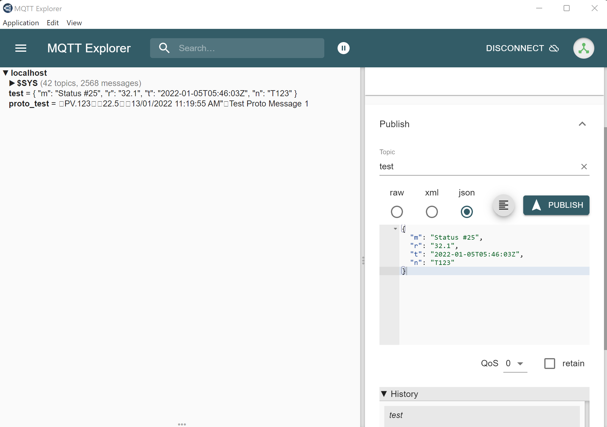

# Overview
This sample demonstrates consuming messages from an MQTT broker and having these written to Azure Data Explorer and Event Hubs. Telgraf using the mqtt plugin subscribes to a topic, parses the payloud, extracts specific fields and writes the output as JSON to Event Hubs and Azure Data Explorer    

# Pre-requisites
The setup steps for this demo assume availability of the following tools and Azure Services
- Azure Kubernetes Service (Dev/Test is fine)
- Azure Data Explorer (Dev/Test is fine)
- Azure Event Hub 
- Kubectl cli 
- Helm v3
- [MQTT Explorer](http://mqtt-explorer.com/)

# Setup


## Azure Data Explorer
- Follow [quickstart](https://docs.microsoft.com/en-us/azure/data-explorer/create-cluster-database-portal?tabs=one-click-create-database) to Create an ADX cluster and database named ```telemetrydb``` to persist the various metrics (defaults for all values).  
- Create a service principal that will be used to access Azure Data Explorer. Save the credentials shown for later use
```
az ad sp create-for-rbac --name telegrafdemo 
```
- Add the service principal as a User to the database. This credential will be used to create tables and append new data
```
.add database telemetrydb users ('aadapp=<appId from previous step>') 'Telegraf App Registration'
```


## Deploy Mosquitto Broker
An MQTT broker is the source of events ingested by Telegraf. 
You can re-use an existing Mosquitto broker that offers anonymous access or set one up on AKS.

## Setup a Mosquitto Broker using Helm
Further details can be found [here](https://artifacthub.io/packages/helm/k8s-at-home/mosquitto) 
```
.\helm repo add k8s-at-home https://k8s-at-home.com/charts/
.\helm repo update
.\helm install mosquitto k8s-at-home/mosquitto
```
MQTT Explorer can be used to run a quick test of the broker.

- Get the pod name, should be named similar to "mosquitto-78769768c5-4475p"
```
kubectl get pods
```
- Use the pod name to forward a local port to the MQTT broker. Port forwarding is optional and depends on the Kubernetes cluster network setup
```
kubectl port-forward <podname> 1883:1883
```
- Setup a connection to the broker. Annonymous authentication is used with a connection to the local port setup for port forwarding. Ensure that certificate validation and encryption are disabled. 

- Test messages can be sent to the broker to confirm functioning of the broker


## Deploy Telegraf
A helm package is used to deploy a Telgraf instance to the AKS cluster. The default configuration file is tailored by supplying a custom yaml file to helm as well as mounting the necessary files needed to process messages using Protocol Buffers.

# Configure ADX Credentials
- Copy the ```telegraf_secrets.yaml.template``` file to a file named ```telegraf_secrets.yaml```
- Update the yaml file with values for the service principal created earlier. The mapping of json fields to yaml is:

|JSON Field|YAML Field|
|---|---|
|tenant|AZURE_TENANT_ID|
|appId|AZURE_CLIENT_ID|
|password|AZURE_CLIENT_SECRET|
- Create a Kubernetes secret using the yaml file
```
kubectl apply -f .\telegraf_secrets.yaml
```
# Configure Protocol Buffer Message Specification
The Telegraf MQTT consumer plugin requires a message specification to parse messages to be stored in ADX. A configmap is used to mount the ```.proto``` file into the Telegraf pod
- To create the configmap run the following command from the root of the repo. A new configmap named telegraf-proto will be created
```
kubectl create configmap telegraf-proto --from-file=.\protobuf\MqttProtobufConsole\devicemessage.proto
```

# Deploy Telegraf
The previous steps created the prequisite Kubernetes resources that are used to customise the default Telegraf instance deployed by the Helm package.
- Customise the configuration yaml file ```values_protobuf.yaml``` by updating the Azure Data Explorer endpoint_url (line 48) with the URI for your Azure Data Explorer cluster (can be found via the portal). The uri will be something like, ```https://<adx cluster name>.<region>.kusto.windows.net```
- From the root of the repo deploy the Telegraf Helm package. Further details can be found [here](https://github.com/influxdata/helm-charts) 
```
helm repo add influxdata https://helm.influxdata.com/
helm repo update
helm upgrade --install my-telegraf -f values_protobuf.yaml influxdata/telegraf
```
- Telegraf will create the necessary tables in ADX as messages are processed. Run the Visual Studio Solution, ```MqttProtobuf.sln" to send a sample protocol buffer message to the MQTT broker for consumption by Telegraf. 
- The sample message can be seen in MQTT Explorer published to the ```proto_test`` topic

- The ```mqtt_consumer``` table has now been created in ADX. All protocol buffer messages sent to the ```proto_test``` topic will be parsed by Telegraf and persisted to this table
- The ```mqtt_consumer``` table will likely have no rows at this time. This is due to the default batching policy. To reduce the time before messages are available for querying in the ```mqtt_consumer``` table the following batching policy can be applied. After running this query new messages will be present in the ```mqtt_consumer``` table after roughly 10 seconds of being published
 ```
.alter table mqtt_consumer policy ingestionbatching @'{"MaximumBatchingTimeSpan":"00:00:10", "MaximumNumberOfItems": 100, "MaximumRawDataSizeMB": 100}'
```


- Additional messages can be sent by re-running the C# application. The messages contents can also be modified by editing the ```Program.cs``` (change the values starting on line 15).